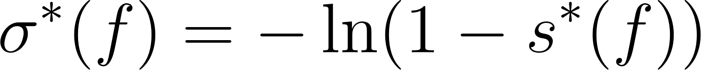
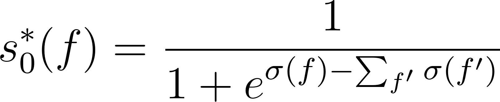
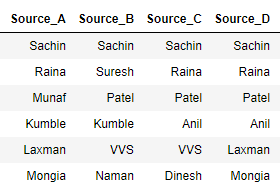

**Krushak Odisha\
Truth Finder Confidence Algorithm**

1.  **[Introduction:]{.underline}**

The Truth Finder Algorithm
[^[\[1\]]{.underline}^](https://ieeexplore.ieee.org/document/4415269) is
a type of Truth discovery method
[^[\[2\]]{.underline}^](https://en.wikipedia.org/wiki/Truth_discovery)
which is the process of extracting the true value from a set of data
sources that provide conflicting information. These methods often
calculate a confidence i.e. probability of value being true for each
fact provided by the data sources and pick the fact with the highest
confidence as the 'true value'. We can leverage these methods by
calculating the confidence of the Krushak Odisha values in the
algorithm.

2.  **[Algorithm Premise:]{.underline}**

The algorithm is based on these 4 premises:

**Premise 1:** **Usually there is only one true fact (Value) for a
property (Data Field) of an object (Farmer Record).\
**We assume that there is only one true fact for a property *(data
field)* of an object *(farmer)*.

*For example: There can only be 1 true value for name of a farmer.*

**Premise 2:** **This true fact (Value) appears to be the same or
similar on different sources**. Different sources that provide this true
fact may present it in either the same or slightly different ways.\
*For example: if 'Aman' is the true value, then there are likely to be
multiple data sources saying 'Aman' and some sources providing similar
names like 'Amin'.*

**Premise 3:** **The false facts (Values) on different sources are less
likely to be the same or similar**: Amongst a set of facts, the sub-set
facts that doesn\'t match with any of the others are unlikely to be
true.\
*For example: For one farmer record, 3 data sources with different
values saying 'Bob', 'Chandru', and 'Dave' are likely to be all false
values*

**Premise 4:** **A source that provides mostly true facts for many
objects will likely provide true facts for other objects**. There are
trustworthy sources such as Aadhaar and untrustworthy sources. A source
that is correct for many objects is more likely to be correct for other
objects

*For example: if 'Aadhaar' is giving truest value of Name for 80% of
farmers, it is more likely than other sources to also give true values
for 20% of the remaining farmers.*

3.  **[Confidence Calculation:]{.underline}**

Defining some terms in the formulae:

**Object:** An object is whatever the informations is being record
about - *in our case each farmer record existing in KO*

**Property:** Property of an object is the characteristic that we have
values for\
*Ex: Farmer Name, Primary mobile number, Landholding size, etc. are
properties in KO of a given object 'Farmer1'*

**f: Fact:** Values provided by a source for the property of an object.\
*Ex.: Aman, Bob, Chandru etc are facts from the 'Farmer Name'
[property]{.underline} of [object]{.underline} 'Farmer1'*

**f': Other Facts:** Facts apart from the Krushak Odisha value for which
the confidence level is being calculated\
*Ex.: Land record area value in PMFBY is the other [fact]{.underline}
for KO's 'Farmer's Area Under Cultivation' [property]{.underline}*

**t(w) : Trustworthiness of the source:** This determines the
reliability of one property of a particular source.

*Ex: t(w) of Aadhar for names is 0.99, t(w) of source A for names is
0.8, t(w) for Aadhar for age is 0.97*

**w: Source:** Each attestation source from which fact f is derived\
*Ex.: PMFBY is a source for [fact]{.underline} 'Land record area value'*

**W: List of all sources:** List of all attestation sources available
for a property\
*Ex.: PMFBY,Seed Supply, P-PAS, M-PAS are sources W for fact KO's Kharif
Crops [property]{.underline}*

**s(f) : Unadjusted confidence:** Confidence of a fact f considering
only those sources which have the fact

**s\*(f) : Adjusted confidence:** Confidence of a fact f adjusted for
other facts f'

**s0\*(f): Scaled Adjusted Confidence:** Adjusted confidence of fact
that has been scaled logistically (from 0-1). [This is the final score
that will be used as the confidence level]{.underline}

**𝛕(w) : Trustworthiness score of the source:** This is a log
transformed version of trustworthiness t(w) of the source w to account
for underflow. Underflow is when extremely low values are created by the
multiplication of the low(1-t(w)) values with each other. The extremely
low values are often rounded off to zero by programs while calculating
leading to unexpected errors

E.g, If we have 10 matching sources and their t(w) is 0.99, then the
product of (1-t(w)) will become 1^-10^

> [{width="2.5390627734033244in"
> height="0.25390638670166227in"}](https://latex-staging.easygenerator.com/eqneditor/editor.php?latex=%5Ctau(w)%3D-%5Cln%20(1-t(w))#0)
> *(1)*

**𝞂(f): Unadjusted confidence score for a fact:** This is a logarithmic
transformed version of unadjusted confidence s(f) again to prevent
underflow

[{width="2.3069663167104113in"
height="0.24283902012248468in"}](https://www.codecogs.com/eqnedit.php?latex=%5Csigma(f)%3D-%5Cln%20(1-s(f))#0)
*(2*)

**𝞂\*(f): Adjusted confidence score for a fact:** This is a logarithmic
transformed version of adjusted confidence s\*(f) to prevent underflow

[{width="2.5640583989501313in"
height="0.24749562554680665in"}](https://www.codecogs.com/eqnedit.php?latex=%5Csigma%5E%7B*%7D(f)%3D-%5Cln%20(1-s%5E%7B*%7D(f))#0)
*(3)*

**Ɣ : Damping factor:** This is a parameter to be provided to the model
to account for lack of independence amongst sources. We will be
considering its value as 1 for now, assuming that the attestation
sources are completely independent of each other. In case of any
interdependence between two or more attestation sources, we can check
for various parameters of Ɣ (from 0-1)

**imp(f'→f): Impact of f' on f:** This is the effect of other facts f'
on fact f. In our case, we can define it as -1 all the time, assuming
that we require all facts to exactly match with each other. This measure
can be improved to use as a similarity score scaled from 1 to -1.

*Ex: if we have Krushak Odisha value as Aman and Source A fact 'Amana',
impact of fact 'Amana' on 'Aman' can be -0.2 and impact of 'Bob' on
'Aman' can be -1. Hence Krushak Odisha value of 'Aman' will have a
higher confidence score if source A says 'Amana' rather 'Bob'*

**[The confidence score can be calculated from the trustworthiness of
each data sources as:]{.underline}**

[{width="2.5978357392825897in"
height="0.5384109798775153in"}](https://www.codecogs.com/eqnedit.php?latex=s_%7B0%7D%5E%7B*%7D(f)%3D%5Cfrac%7B1%7D%7B1%2Be%5E%7B%5Csigma(f)-%5Csum_%7Bf%5E%7B%5Cprime%7D%7D%20%5Csigma%5Cleft(f%5E%7B%5Cprime%7D%5Cright)%20%7D#0)
*(4)*

where,

[{width="1.6119794400699912in"
height="0.3645833333333333in"}](https://www.codecogs.com/eqnedit.php?latex=%5Csigma(f)%3D%5Csum_%7Bw%20%5Cin%20W(f)%7D%20%5Ctau(w)#0)
*(5)*

and,

[{width="2.139810804899388in"
height="0.25in"}](https://latex-staging.easygenerator.com/eqneditor/editor.php?latex=%5Ctau(w)%3D-%5Cln%20(1-t(w))#0)
*(1)*

**[Illustrative Example for calculating confidence:]{.underline}**

We want to calculate the confidence for a farmer's name and we have
corresponding values available from 4 different attestation sources A,
B, C, and D as Bob, Aman, Charan, and Aman as shown below.

Let us assume we have trustworthiness values for each data source as
shown below. We can calculate the trustworthiness score from the above
equations:

{width="6.684383202099737in"
height="1.0416666666666667in"}

*[Image - 3.1]{.underline}*

We have 3 facts here - 'Bob', 'Aman' and 'Charan'

From the equations above, we can calculate the unadjusted confidence
scores as:

**𝞂(Bob) = 𝛕(Source A) = 2.3** *(from equation 5)*

**𝞂(Aman)= 𝛕(Source B) + 𝛕(Source D) = 1.72 + 1.53 = 3.25** *(from
equation 5)*

**𝞂(Charan)= 𝛕(Source C) = 1.36** *(from equation 5)*

Here, as Krushak Odisha value is 'Aman' for which we need to calculate
the confidence,

**f= 'Aman' and f' = {'Bob','Charan'}**

Hence, to find confidence from equation 4, we can calculate {𝞂(f) - Σ
𝞂(f')} first which is within the denominator (needs to exponentiated)

**𝞂(f) - Σ 𝞂(f') = 𝞂(Aman) - 𝞂(Bob) - 𝞂(Charan) = 3.25 -2.3 -1.36 =
-0.41**

**Final confidence = 1/(1+e ^-(-0.41)^)= 0.39** *(from equation 4)*

4.  **[Algorithm iteration:]{.underline}**

The algorithm is iterative, gradually improving the estimate of the
confidence score and the trustworthiness of the sources. It considers
trustworthiness of a source to be the average confidence of all the
facts provided by it.

**t(w) = average(s~0~\*(f))**

Steps to run the algorithm:

**Step I:** Assume t(w) for all sources = 0.5

**Step II:** Update the confidence values for all the objects using the
above calculations

**Step III:** Update the t(w) for all the sources by taking the average
of confidence for each source

**Step IV:** Repeat the process until t(w) doesn't change from the last
iteration

**Step V:** Calculate the final confidence values from t(w)

{width="4.538017279090114in"
height="4.065511811023622in"}

*[Image - 4.1: Sample Dataset for property 'Farmer Name']{.underline}*

**Step I:**

We assume that t(w) of all sources = 0.5

**Iteration 1 :**

t(w):

{width="3.2604166666666665in"
height="0.7916666666666666in"}

*[Image - 4.3]{.underline}*

**Step II:** Update the confidence values for all the objects using the
equation 4

*[Image 4.3]{.underline}* shows a set of rows from the data considered
and *[Image 4.4]{.underline}* shows the calculated confidence scores

{width="2.9166666666666665in"
height="2.0208333333333335in"}{width="3.1458333333333335in"
height="1.8958333333333333in"}

*[Image - 4.3]{.underline}* *[Image - 4.4]{.underline}*

**Step III:** Update the t(w)for all the sources by taking the average
of confidence for each source:

The new t(w) values can be calculated by taking the average of the
confidence calculated for each of the sources:

{width="3.3125in"
height="0.5729166666666666in"}

*[Image - 4.5]{.underline}*

**Step IV:** We need to keep iterating i.e. repeat the steps starting
from *[Step II]{.underline}* but considering the t(w) values that were
calculated in *[Step 3]{.underline}*:

Repeating *[Step 2]{.underline}* with the new t(w) values, we get :

{width="2.9166666666666665in"
height="2.0208333333333335in"}{width="3.1770833333333335in"
height="1.9166666666666667in"}

*[Image - 4.6]{.underline} [Image - 4.7]{.underline}*

And then calculating the new t(w) values , we get :

{width="3.2395833333333335in"
height="0.7083333333333334in"}

*[Image - 4.8]{.underline}*

We must keep iterating this process until the t(w) value stops changing.
*[Image - 4.8]{.underline}* is showing the t(w) values for 10
iterations:

{width="3.2604166666666665in"
height="3.03125in"}

*[Image - 4.9]{.underline}*

As we can see above, it starts with 0.5 for all sources and then keeps
changing with every iteration. However the degree of change keeps
reducing with each iteration and by the tenth iteration, the degree of
change is negligible and the algorithm is stopped.

*We've put the condition that the algorithm stops when the difference
between t(w) of 2 consecutive iterations is less than 0.001*

**Step V:** We calculate the final confidence values based on the last
iterations' t(w) values using Equation 4:

{width="2.9166666666666665in"
height="2.0208333333333335in"}{width="3.1145833333333335in"
height="1.8958333333333333in"}

*[Image - 4.10]{.underline} [Image - 4.11]{.underline}*

We can the calculate the KO values confidence by matching the KO values
to the source:

{width="5.760416666666667in"
height="2.0104166666666665in"}

*[Image - 4.12]{.underline}*

**[Annexure:]{.underline}\
**

1.  **Why are we following the Truth Finder Algorithm to calculate the
    > confidence level of our data points? Is there any precedence
    > establishing that this is the best/ideal way to go about it?**

-   The Truth Finder algorithm is a well-known research paper cited
    > extensively in the data science world
    > [^[\[1\]]{.underline}^](https://ieeexplore.ieee.org/document/4415269/citations?tabFilter=papers#anchor-paper-citations-nonieee)
    > including by Google for it's Knowledge-based-Trust Algorithm
    > [^[\[2\]]{.underline}^](https://www.vldb.org/pvldb/vol8/p938-dong.pdf)
    > which is Google's patented method of carrying out
    > truth-discovery[^[\[8\]]{.underline}^](https://economictimes.indiatimes.com/magazines/panache/google-to-rank-websites-based-on-facts-not-links/articleshow/46429104.cms?from=mdr)
    > to improve its search results. It's based on the same iterative
    > principles as Page-Rank but considering the reliability of
    > websites instead of
    > number/quality[^[\[3\]]{.underline}^](https://en.wikipedia.org/wiki/Truth_discovery#Web-link_based).

-   Model is completely data driven and does not require estimating any
    > accuracy parameters

-   Model is relatively simple to implement, runs quickly and does not
    > require expensive infra

-   Model works well with low number of data sources (most truth
    > discovery models are built for websites and often scrape from
    > 1000's of websites to check)

-   The model has been implemented previously as open source code in
    > Java/R
    > [^[\[4\]]{.underline}^](https://rdrr.io/github/rodrigowang/truthfinder/src/R/truthfinder.R)
    > [^[\[5\]]{.underline}^](https://github.com/LaureBerti/Truth_Discovery_Comparative_Analysis)

2.  **Where has this model been implemented previously? Can we get some
    > test results or evidence of success for this model?**

-   The Truth finder consistently displays good results for truth
    > discovery on real world data sets: In this
    > work[^[\[6\]]{.underline}^](https://arxiv.org/pdf/1409.6428), it
    > was tested on the following datasets:

    -   **The AbeBooks data set** : It's a comparison of author details
        > for computer science books extracted from AbeBooks websites in
        > 2007 It consisted of 33,235 claims on the author names of
        > 1,263 books by 877 book seller sources.

> The 'true value' was available for 100 randomly sampled books for
> which the book covers were manually verified by the authors.
>
> The Truth finder algorithm had an accuracy of 94% which was 2nd best
> amongst algorithms compared with the least computation time

-   **Weather data set :** The Weather data set consists of 426,360
    > claims from 18 sources on the Web for 5 properties (temperature,
    > humidity etc) on hourly weather for 49 US cities between January
    > and February 2010. 'True value', was deemed to be the AccuWeather
    > website values which were available in 75% of the cases

> Truth Finder had an accuracy of 86% which was the best amongst all
> algorithms compared with the least computation time

-   **Biography data set :** The Weather data set consists of 9
    > biography details (father name, mother name, age etc) extracted
    > from Wikipedia with 10,862,648 claims over 19,606 people and 9
    > attributes from 771,132 online sources

> Truth Finder had an accuracy of 90% which was the 2nd best amongst all
> algorithms compared with the least computation time

-   **Biography data set :** The Population data set consists of 49,955
    > claims on city population extracted from Wikipedia edits from
    > 4,264 sources. The 'true value' was considered to be the official
    > US census data.

> Truth Finder had an accuracy of 87% which was the 2nd best amongst all
> the algorithms
